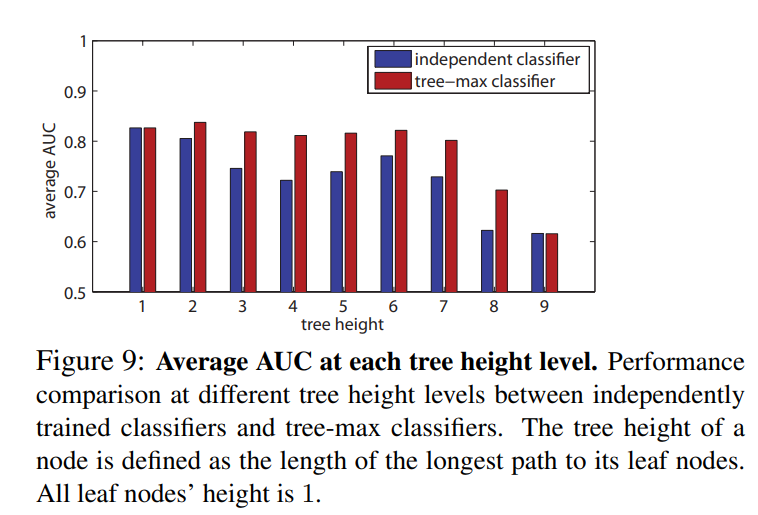

Basically I believe that we can just do big convolution net with normalization. (batch norm, AdamW)

Probably we can follow the mlac stuff Simon did, where we train model per class in hierarchy (also for the parent nodes), and then somehow on prediction we combine predictions from different models.

So the idea also mentioned in ImageNet paper to train binary classifier for each hierarchy, we take 90% of data of this hierarchy as positive examples and then take x images from other hierarchies (excluding child and parent hierarchies) as negative examples and the rest 10% is for testing. Then when we don't just predict for value for specific node, but rather for all the children and then the maximum of responses in subtree becomes the final score. This idea is called Tree-max classifier.

It looks on the benchmark that it outperforms, just normal classification into leaf category (at least at higher levels)

To exploit a hierarchy, we could also do a custom loss function where cost of predicting node closer in a tree (like a parent) should _cost_ less than prediction completely foreign concept. Basically we would punish the model more the higher in tree the classifying mistake happened.

Also we could make it so that the more photos user uploads the more certain prediction is, as we would do prediction per image and average the class, that way the result we would get would be more certain

#### Semantic hierarchic classifier
- binary detector
  - they used not a nn but rather normal model and extracted the features from it (like the hue, gradient orientation etc)
  - split image into patches using some detector and do extraction per patch
  - create visual vocabulary by clustering subset of features from training set
  - they create a hierarchy by starting at the leaf node and going up only through holonymy/meronymy links (is part of/is member of)
  - starting from the root predict true or false for node and follow this path until u reach leaf node
  - to reduce number of classifiers, they I guess clustered some nodes into common nodes (didn't really follow math on that -> we can achieve that too by pruning pointless nodes etc)

#### Flat vs hierarchical classificatation
- it is not said that flat classification will give worse result
- when doing hierarchical classification, we have the opportunity to only retrain the models that perform worse than rest of models, meaning we can focus on specific classes that model has issue with (not possible in flat scenario)

## Architecture approaches we should try out:
- baseline CNN don't use hierarchy just leaf nodes
- B-CNN, CNN where after each convolution we predict one level of classification, loss is weighted using all outputs
- CNN-RNN, where we use CNN for all the nodes in hierarchy and then use its output as input to RNN to get classification that is using relationship between levels
- Binary CNN classifiers one per each level and we just follow the path with the most yes options to reach leaf node (kinda dumb for not a binary tree)
- CNN model for each that predicts one of the child of the node, and we just follow the path (similar to one above)

